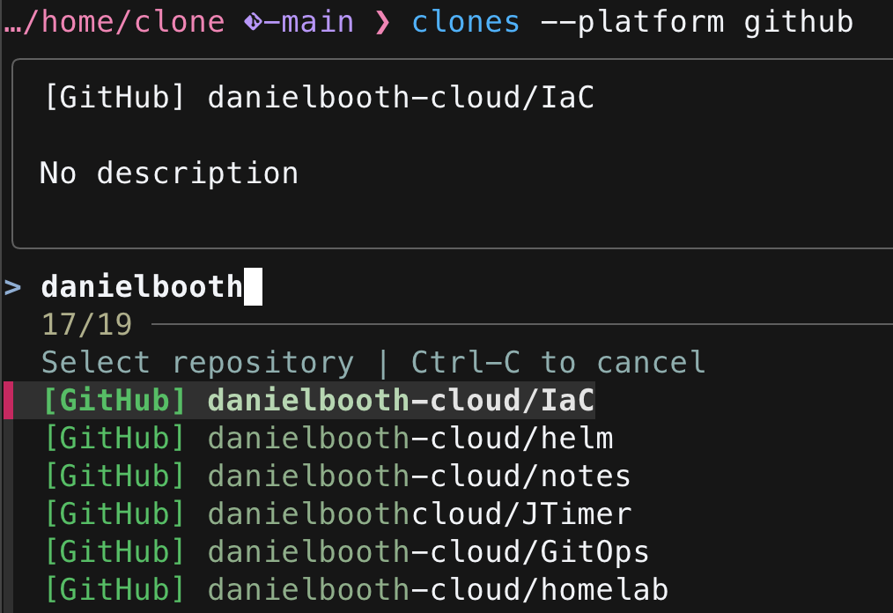

# clones

Interactive CLI for cloning and managing Git repos from GitHub and GitLab. Uses `fzf` for fuzzy finding, NutsDB for caching, and optional Jira integration for ticket labels.


## Install

```bash
go install github.com/danielboothcloud/clones@latest
```

Or build from source:

```bash
go build -o ~/.local/bin/clones .
```

Requires `fzf`, `git`, and auth via `gh auth login` / `glab auth login` (or `GITHUB_TOKEN` / `GITLAB_TOKEN` env vars).

## Shell Wrapper

The binary outputs a directory path to stdout — the shell wrapper captures it to auto-cd and open your editor. Add this function to `~/.zshrc` or `~/.bashrc`:

```bash
clones() {
  local target_dir
  target_dir=$(command clones "$@")
  local exit_code=$?

  if [[ $target_dir == EDIT:* ]]; then
    local repo_path="${target_dir#EDIT:}"
    if [[ -d "$repo_path" ]]; then
      cd "$repo_path" || return 1
      ${EDITOR:-vi} .
    fi
    return
  fi

  if [[ $exit_code -eq 0 && -d "$target_dir" ]]; then
    cd "$target_dir" || return 1
  fi
}
```

## Usage

```bash
clones                       # browse all repos (remote + local)
clones terraform             # filter by name
clones -l                    # local repos only (cd, pull, push, delete, edit)
clones -r                    # remote repos only
clones --platform gitlab     # single platform
clones --no-cache            # bypass NutsDB cache
clones --jira                # only repos with active Jira tickets
```

Repos clone to `~/projects/work/<owner>/<repo>`.

## Cache

Repos are cached in NutsDB at `~/.cache/clones/db/` with 24h TTL. Stale cache is served instantly while a background refresh runs for next time.

## Exclude Patterns

Create `~/.config/clones/exclude.txt` to hide repos from results. One pattern per line, matched against `owner/name`, `platform/owner/name`, and description. Lines starting with `#` are comments.

```
archived
/deprecated/
some-org/old-project
```

## Jira Integration

Optional. Configure `~/.config/clones/jira.yml`:

```yaml
enabled: true
base_url: https://yourorg.atlassian.net
email: you@example.com
jql: assignee = currentUser() AND status not in (Closed, Done, Completed)
active_statuses: In Progress, In Review, To Do, Pending
```

When enabled, local repos show Jira ticket labels extracted from branch names (e.g. `feature/PROJ-123` shows `[PROJ-123]`). The JQL filter controls which tickets are displayed. Set `enabled: false` or remove the file to disable.

## License

MIT
